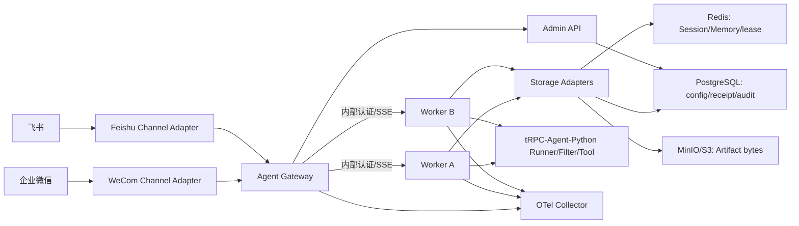
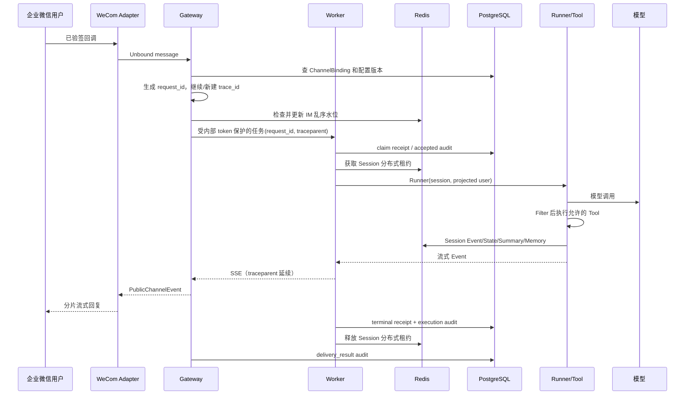

# 多租户节点化 Agent 平台架构

本平台将公网入口、执行节点和共享数据层分开。租户配置、绑定、审计和元数据保存在 PostgreSQL；Redis 提供共享 Session/Memory 与跨 Worker 互斥；MinIO/S3 保存 Artifact 字节。Worker 因而不保存会话本地真相，不需要 sticky session：Gateway 用 Rendezvous Hashing 优先选择节点，节点故障时由其他健康 Worker 从共享后端继续处理；同一 Session 仍由 Redis 租约串行化。

## 租户和节点边界

Gateway 先以启用的 `ChannelBinding` 将已认证 IM 账号绑定到唯一 tenant/app；Console/API 输入也必须带租户。随后 `project_identity` 将外部用户与会话投影为不可逆内部 ID，并把 binding 纳入散列，避免同一外部账号跨租户碰撞。版本化 `TenantConfig` 同时携带应用、模型、工具白名单、治理、后端和审计策略；Worker 会复核 tenant/app/version，工具 Filter 与内容、预算门均在执行前失败关闭。

共享存储使 Worker 可水平扩展，但不意味着同会话并行执行：`ExecutionCoordinator` 使用 Redis 租约，PostgreSQL `message_receipts` 用业务唯一键完成消息 claim、重放与冲突拒绝。日志、Span 和审计不记录正文、原始外部身份或密钥；连接字符串和错误均经过固定安全映射。IM secret 仅以 `secret_ref=env:TRPC_*` 引用，数据库不存 secret。

## 完整企业微信消息链路

`request_id` 是一条执行和审计查询的稳定关联键；`trace_id` 仅在有效 OpenTelemetry Span 中记录，用于跨 Gateway、Worker、Runner、Tool 与存储观测关联。重复 message_id 不重跑模型/工具，而是安全重放既有终态。

## tRPC-Agent-Python 与平台层责任

| 范围 | 直接复用 SDK | 平台新增实现 |
|---|---|---|
| Agent 执行 | `OpenAIModel`、`LlmAgent`、`Runner`、`Event`、Function/LongRunning Tool | tenant runtime 缓存、Worker 协议、receipt 事务 |
| Session/Memory | SDK Session/Memory 抽象与 Event 语义 | Redis/SQL resolver、租约、离线迁移 |
| 治理 | SDK `BaseFilter` | 租户策略、内容/预算门、审批与审计 |
| IM | SDK Agent Event | 企微/飞书 facade、binding、身份投影、乱序与投递策略 |
| 可观测 | OpenTelemetry API | 安全 Span/exporter、指标白名单、统一审计查询 |

企微使用 AI Bot 长连接与快照式流式回复；飞书使用事件订阅和单卡片流 writer。二者都先解码为无租户消息，再由持久化 binding 授权；真实外部验收只在操作者提供对应凭据时进行，不能由 Console 替代。

## IM 账号绑定、认证与平台差异

每个启用的 `ChannelBinding` 以 `(channel, external_account_id)` 唯一定位一个平台账号，并保存
`tenant_id`、`app_id` 和不含密钥值的 `secret_ref=env:TRPC_*`。企业微信 HTTP callback 还可保存
`webhook_token_ref`、`webhook_aes_key_ref`；运行中的 Adapter 只能先以这些引用解析
secret，再接受与 binding 完全匹配的账号事件；未经 binding 授权的事件在进入 Gateway 前拒绝。外部用户和
单聊/群聊会话都会投影为 tenant 作用域内部 ID，因此相同平台用户、跨群或跨租户都不会共享 Session。

| 平台 | 入站认证与 Callback 边界 | 出站形式与限制 | 非文本/失败处理 |
|---|---|---|---|
| 企业微信 AI Bot / 标准 callback | 长连接继续用 `secret_ref`。HTTP 模式使用 `GET|POST /webhooks/wecom/{external_account_id}`：Token 的 SHA-1 排序签名先校验，EncodingAESKey 以 AES-256-CBC 解密，明文 receive-id 必须精确等于 binding account；GET 只返回 challenge，POST 文本才进入 binding。 | 两种模式最终都进入 ChannelIngress、Worker 和 receipt；SDK 路径仍用累计快照流。 | 验签/解密失败 401，未知 binding 404；图片、文件和未知类型固定拒绝且零 Worker。 |
| 飞书 AI Bot | 采用 SDK 事件订阅长连接，以 App secret（由 `secret_ref` 解析）认证；同样没有本平台模式下的公网 Webhook URL/token。SDK 负责事件来源校验，binding 再决定 tenant/app。 | SDK 流式卡片 writer 接收公开文本和 finished 标记；同样执行 4000 字符分片与租户限流。 | 图片、文件、撤回和未知事件固定拒绝、零 Worker；投递只重试未发送操作，终态写入脱敏 delivery audit。 |

Compose/Kubernetes 可暴露企业微信 HTTP callback，但只有具备两个 webhook secret refs 的 binding 才能通过
回调验签；两种 Adapter 的
真实 SDK 路径、binding、去重/乱序门和流式转换均有自动化测试；真实账号验收仍由账号持有人按 README 的
配置步骤发送一条消息完成。
